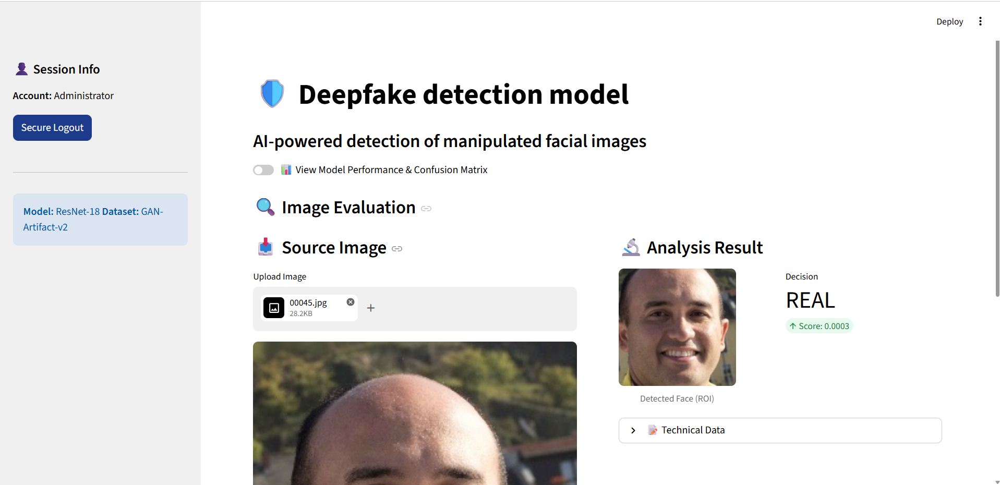
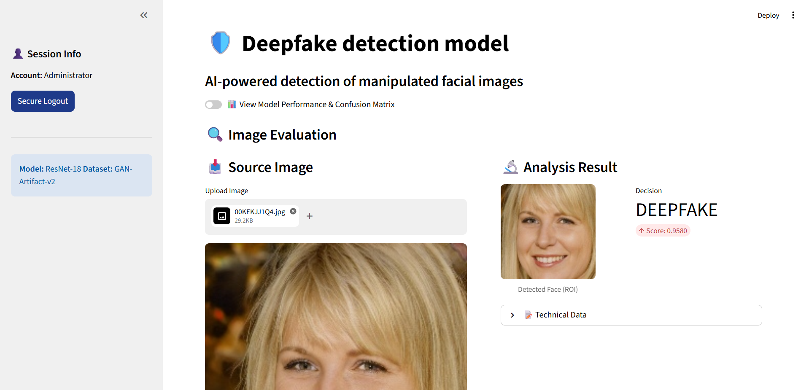

# 🛡️ Deepfake Detection Model

An AI-powered forensic tool designed to detect manipulated facial images (Deepfakes) using a **ResNet-18** deep learning backbone. The application includes a modular training and evaluation pipeline, automated face detection/cropping (ROI identification) using Haar Cascades, and an interactive **Streamlit dashboard** for visualizing model performance and evaluating source images.

---

## 🚀 Key Features

* **High Accuracy Backbone:** Employs a pre-trained **ResNet-18** model customized for binary classification (Real vs. Fake).
* **Automated Preprocessing & ROI Extraction:** Integrates OpenCV Haar Cascades to automatically locate, crop, and resize the main face region (`224x224`) from uploaded photos.
* **Interactive Streamlit Web Dashboard:**
  * **Secure Access:** Built-in authentication (authorized credentials only).
  * **Analytical Metrics:** Multi-metric scorecard displaying Model Accuracy, Precision, Recall, F1 Score, and interactive confusion matrices.
  * **Real-time Evaluation:** Quick-drag image uploader showing the processed facial ROI alongside raw sigmoid output and integrity status (Intact vs. Compromised).
* **Flexible Training & Evaluation Suites:** Fast training scripts using multi-threaded batching (optimized using `os.scandir` indexing) and extensive metric evaluation utilities.

---

## 📸 Screenshots

| Real Image Evaluation | Deepfake Image Evaluation |
| :---: | :---: |
|  |  |

---

## 📁 Repository Structure

```text
Deepfake Detection Model/
│
├── app/
│   └── streamlit_app.py           # Streamlit dashboard (frontend interface & routing)
│
├── dataset/                       # Directory containing real and fake image files
│
├── models/
│   ├── model_architecture.py      # ResNet-18 classifier architecture definition
│   ├── best_deepfake_model.pth    # Saved checkpoint weights for optimal performance
│   └── trained_model.pth          # Saved checkpoint weights from the training script
│
├── src/
│   ├── __init__.py
│   ├── inference/
│   │   └── predict.py             # Inference pipeline & model loading routines
│   │
│   ├── preprocessing/
│   │   ├── face_detection.py      # Haar Cascade face detector & crop utility
│   │   ├── image_alignment.py     # Alignment placeholder stub
│   │   └── transforms.py          # Data augmentation/transformation placeholder stub
│   │
│   ├── training/
│   │   ├── evaluate.py            # Evaluation suite (outputs accuracy, precision, confusion matrix)
│   │   └── train.py               # Fast training pipeline script
│   │
│   └── utils/
│       └── helpers.py             # Utility functions helper stub
│
├── requirements.txt               # Python package dependencies
├── packages.txt                   # OS level dependencies (e.g. OpenCV GUI requirements)
└── README.md                      # Project documentation (this file)
```

---

## ⚙️ Installation & Setup

### 1. Prerequisites
Ensure you have **Python 3.8+** installed.

### 2. Set Up a Virtual Environment (Recommended)
```bash
# Create a virtual environment
python -m venv venv

# Activate the virtual environment
# On Windows (Command Prompt)
venv\Scripts\activate.bat
# On Windows (PowerShell)
.\venv\Scripts\Activate.ps1
# On macOS/Linux
source venv/bin/activate
```

### 3. Install Dependencies
Install all Python requirements using `pip`:
```bash
pip install -r requirements.txt
```

If you are running in a Linux/Headless environment (like Docker or Streamlit Cloud), make sure system-level packages for OpenCV graphics support are installed. They are defined in [packages.txt](file:///d:/Deepfake%20Detection%20Model/packages.txt):
```bash
sudo apt-get update && sudo apt-get install -y libgl1-mesa-glx
```

---

## 🖥️ Running the Streamlit App

Launch the local interactive application:
```bash
streamlit run app/streamlit_app.py
```

### Authentication Credentials
By default, the Streamlit app requires authentication to access the dashboard.
* **Username:** `admin`
* **Password:** `admin`

### App Features:
1. **Model Performance:** Toggle the metric dashboard to review test scores and plot the confusion matrix.
2. **Evaluation:** Upload any image (`.jpg`, `.jpeg`, `.png`), view the isolated face area (ROI), and view the detection probability:
   * **`REAL`** (Sigmoid output < `0.35`)
   * **`DEEPFAKE`** (Sigmoid output > `0.65`)
   * **`UNCERTAIN`** (Sigmoid output between `0.35` and `0.65`)

---

## 📂 Dataset

The model is trained and evaluated using the **140k Real and Fake Faces** dataset on Kaggle.

* **Dataset Link:** [Kaggle - 140k Real and Fake Faces](https://www.kaggle.com/datasets/xhlulu/140k-real-and-fake-faces)
* **Structure:** The dataset contains balanced sets of real and GAN-generated fake face images partitioned into `train`, `test`, and `valid` subsets.

---

## 🧠 Training & Evaluation

### Training the Model
To re-train the detector model with your own dataset:
1. Place your training dataset images inside:
   * `data/processed/train/real/`
   * `data/processed/train/fake/`
2. Run the training script:
   ```bash
   python src/training/train.py
   ```
*This script will load up to 15,000 images per class (30,000 total), train for 5 epochs using AdamW, and save the best checkpoint to `models/best_deepfake_model.pth`.*

### Evaluating the Model
To run an offline evaluation of the test set:
1. Ensure your test set is situated in:
   * `dataset/real_vs_fake/real-vs-fake/test/`
2. Run the evaluation suite:
   ```bash
   python src/training/evaluate.py
   ```
*This selects a balanced subset of 1,000 images (500 real, 500 fake), runs classification, and logs accuracy, precision, recall, F1-Score, and the confusion matrix.*

---

## 📊 Model Performance

Tested against the validation/test partitions of the **GAN-Artifact-v2** dataset:

| Metric | Score |
| :--- | :--- |
| **Accuracy** | **94.50%** |
| **Precision** | **90.53%** |
| **Recall** | **99.40%** |
| **F1 Score** | **94.76%** |

### Confusion Matrix (Test Set)

| Actual \ Predicted | Predicted Fake | Predicted Real |
| :--- | :---: | :---: |
| **Actual Fake** | **448** (True Positive) | **52** (False Negative) |
| **Actual Real** | **3** (False Positive) | **497** (True Negative) |

---

## 🛠️ Technology Stack

* **Machine Learning:** PyTorch, Torchvision, Scikit-learn
* **Computer Vision:** OpenCV (Haar Cascades for face detection)
* **Frontend Web Framework:** Streamlit
* **Data Manipulation & Visualization:** NumPy, Pandas, Matplotlib, Seaborn
